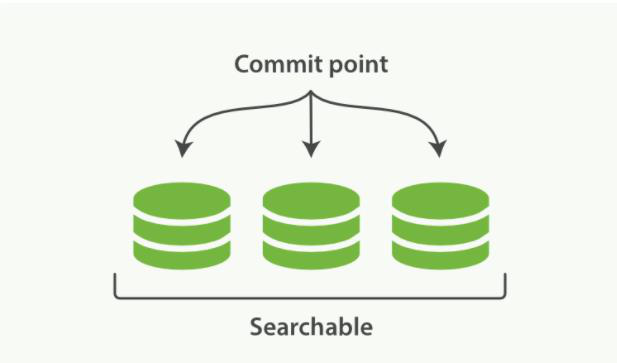
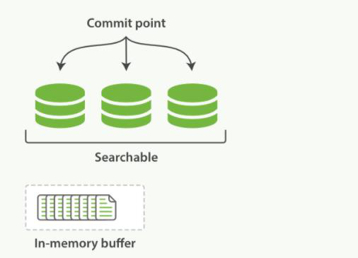
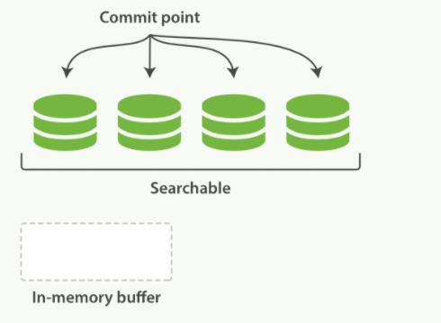
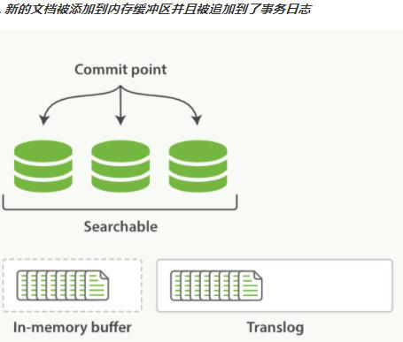
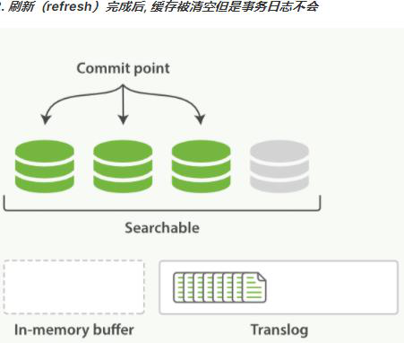
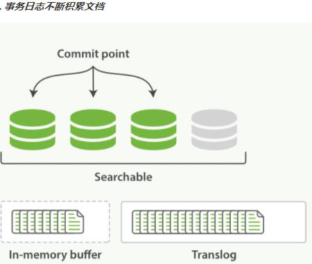
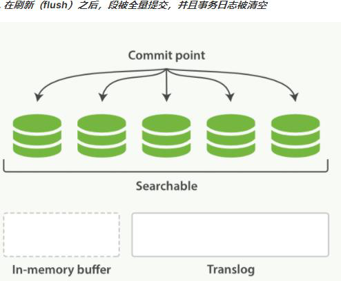
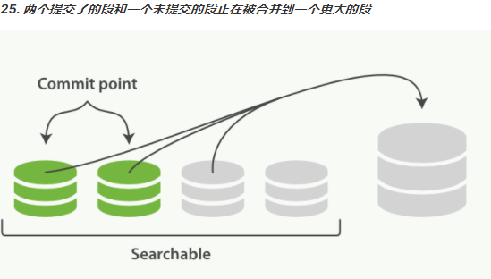

###### jdk8安装

##### 先查看centos中自带的jdk并卸载

```shell
[root@root ~]# rpm -qa | grep jkd    //查看
[root@root ~]rpm -e | grep java     //删除
# 卸载 -e --nodeps 强制删除
[root@kuangshen ~]# rpm -e --nodeps jdk1.8.0_121-1.8.0_121-fcs.x86_64
```

##### jdk8安装

```shell
[root@root ~] yum install java-1.8.0-openjdk.x86_64
 yum install java-1.8.0-openjdk.aarch64
#一直y确定

# 检验安装
[root@root ~] java -version

#设置jdk环境变量
[root@root alternatives]# vi /etc/profile

#在文件最后加入如下配置：
#set java environment
JAVA_HOME= /usr/lib/jvm/java-1.8.0-openjdk-1.8.0.262.b10-0.el7_8.x86_64/jre
PATH=$PATH:$JAVA_HOME/bin
CLASSPATH=.:$JAVA_HOME/lib
export JAVA_HOME CLASSPATH PATH

#使profile文件立马生效
[root@root alternatives]#. /etc/profile   
```

#### 安装ES7.6.1

> 引用 https://www.jianshu.com/p/b670648be8bb

> **新建用户并创建data跟logs目录（elasticsearch的策略会阻止root用户运行）**

```shell
useradd es
su es
cd ~ 
mkdir -p software/es
cd software/es
mkdir data logs
```

> **下载elasticsearch7.6.1安装包、并解压**

```shell
wget https://artifacts.elastic.co/downloads/elasticsearch/elasticsearch-7.6.1-linux-x86_64.tar.gz

tar -xzvf elasticsearch-7.6.1-linux-x86_64.tar.gz
```

> **修改elasticsearch配置文件 (config/elasticsearch.yml) **

```shell
cluster.name: my-es
node.name: master
path.data: /home/es/software/es/data
path.logs: /home/es/software/es/log
network.host: 0.0.0.0 #如果需要外网访问则需要设置成0.0.0.0
http.port: 9200
discovery.seed_hosts: ["127.0.0.1"]
cluster.initial_master_nodes: ["master"]
node.master: true
node.data: true
```

##### 基础命令

```shell
#启动命令
./bin/elasticsearch
#启动一个集群节点
bin/elasticsearch -E node.name=node1 -E cluster.name=my-es -E path.data=node1_data -E http.port=9201
#停止启动
#查找ES进程
ps -ef | grep elastic
#杀掉ES进程
kill -9 2382（进程号）
```

##### 查询命令

```shell
match_phrase #会将检索关键词分词。match_phrase的分词结果必须在被检索字段的分词中都包含，而且顺序必须相同，而且默认必须都是连续的
match #会对输入进行分词处理后再去查询，部分命中的结果也会按照评分由高到低显示出来。
term #是将传入的文本原封不动地（不分词）拿去查询。

#bool查询 https://www.cnblogs.com/qdhxhz/p/11529107.html
must：    必须匹配。贡献算分
must_not：过滤子句，必须不能匹配，但不贡献算分 
should：  选择性匹配，至少满足一条。贡献算分
filter：  过滤子句，必须匹配，但不贡献算分

#boosting query 
#有一种场景就是我并不需要完全剔除，而是把需要剔除的那部分文档的,这个时候就可以使用boosting query
#boosting需要搭配三个关键字 positive , negative , negative_boost
#只有匹配了 positive查询 的文档才会被包含到结果集中，但是同时匹配了negative查询 的文档会被降低其相关度，通过将文档原本的_score和negative_boost参数进行相乘来得到新的_score。因此，negative_boost参数一般小于1.0。在下面的例子中，任何包含了指定负面词条的文档的_score都会是其原本_score的一半。

POST news/_search
{
  "query": {
    "boosting": {
      "positive": {
        "match": {
          "content": "apple"
        }
      },
      "negative": {
        "match": {
          "content": "pie"
        }
      },
      "negative_boost": 0.5
    }
  }
}

#constant_score(固定分数查询) 
#定义 常量分值查询，目的就是返回指定的score，一般都结合filter使用，因为filter context忽略score
POST news/_search
{
  "query": {
    "constant_score": {
      "filter": {
        "match": {
         "content":"apple"
        }
      },
      "boost": 2.5
    }
  }
}
#运行结果如下,可以看出分数都是2.5。
```


```shell
#dis_max(最佳匹配查询）
#只是取分数最高的那个query的分数而已。
GET /_search
{
    "query": {
        "dis_max" : {
            "queries" : [
                { "term" : { "title" : "Quick pets" }},
                { "term" : { "body" : "Quick pets" }}
            ],
            "tie_breaker" : 0.7
        }
    }
}
#解释：假设一条文档的'title'查询得分是 1，'body'查询得分是1.6。那么总得分为：1.6+1*0.7 = 2.3。如果我们去掉"tie_breaker" : 0.7 ，那么tie_breaker默认为0，那么这条文档的得分就是 1.6 + 1*0 = 1.6


```

##### 授权用户文件夹权限

``` shell
#授权文件夹权限 my文件夹和里面的文件权限都是不同的。现在递归修改，都改为统一的权限777
 chmod -R 777 my/
```

##### 问题解决

> **max virtual memory areas vm.max_map_count [65530] likely too low, increase to at least [262144]** 

```shell
#切换到root用户修改配置sysctl.conf

vi /etc/sysctl.conf 

#添加下面配置：

vm.max_map_count=655360

#并执行命令：

sysctl -p
```

> **max file descriptors [4096] for elasticsearch process is too low, increase to at least [65535]**

```shell
#打开/etc/security/limits.conf，在里面添加如下内容,其中*表示所有用户 nofile表示最大文件句柄数,表示能够打开的最大文件数目

* soft nofile 65536
* hard nofile 65536

#编辑/etc/pam.d/common-session，添加如下内容
session required pam_limits.so 

#编辑/etc/profile，添加如下内容
ulimit -SHn 65536

#然后重新启动机器,再利用ulimit -n查看文件句柄数,发现文件句柄数变为65536
```

#### IK分词器的安装

- **下载ik分词器**

```shell
https://github.com//medcl/elasticsearch-analysis-ik/releases/download/v7.6.1/elasticsearch-analysis-ik-7.6.1.zip
```

- **在es目录下的plugins文件下创建ik文件夹**
- **将下载的elasticsearch-analysis-ik-7.6.1.zip解压到ik文件夹中，重启es**
- **验证是否安装成功语句如下**

```shell
POST http://172.16.95.136:9200/_analyze
{
  "analyzer": "ik_max_word",
  "text":     "中华人民共和国国歌"
}
```

#### kibana安装

- 下载安装

```shell
wget https://artifacts.elastic.co/downloads/kibana/kibana-7.6.1-x86_64.rpm
yum install -y kibana-7.6.1-x86_64.rpm
```

- 修改配置文件

  进入：/etc/kibana/kibana.yml

```shell
server.port: 5606 #kibana端口号
server.host: "172.16.95.136"#kibana服务ip地址
server.name: tanklog
elasticsearch.hosts: ["http://172.0.0.1:9200/"] #es地址
```

##### 基础命令

```shell
sudo service kibana start #
sudo service kibana stop
```


- 停用kibana

```shell
netstat -tunlp|grep 5606# 查看占用端口5601端口的进程
```


```shell
kill -9 34269 #杀进程
```

>**杀死进程后又重启的解决方案**

```shell
ps -aux | grep kibana 命令找到pid号
cd /proc/PID号
cat status, 找到父进程的PPID号
#先杀掉父进程
kill -9 PPID号
#再杀掉子进程 这时候很大可能性子进程已经和父进程一起被杀死了，如果没被杀死，就使用以下命令杀死子进程
kill -9 PID号
```

> **查看日志**

```shell
cd /var/log/kibana/ #错误日志地址
```


#### ES核心概念

##### 动态更新索引

> **如何在保留不变性的前提下实现倒排索引的更新**

```shell
用更多的索引。通过增加新的补充索引来反映新近的修改，而不是直接重写整个倒排索引。每一个倒排索引都会被轮流查询到，从最早的开始查询完后再对结果进行合并。Elasticsearch 基于 Lucene, 这个 java 库引入了按段搜索的概念。 每一段本身都是一个倒排索引，但索引在 Lucene中除表示所有段的集合外，还增加了提交点的概念一个列出了所有已知段的文件
```



​	   按段搜索会以如下流程执行：

- 新文档被收集到内存索引缓存。

  

- 不时地, 缓存被 提交。

  - 一个新的段—一个追加的倒排索引—被写入磁盘。

  - 一个新的包含新段名字的 提交点 被写入磁盘

  - 磁盘进行 同步—所有在文件系统缓存中等待的写入都刷新到磁盘，以确保它们

    被写入物理文件。

- 新的段被开启，让它包含的文档可见以被搜索
- 内存缓存被清空，等待接收新的文档



```shell
当一个查询被触发，所有已知的段按顺序被查询。词项统计会对所有段的结果进行聚合，以保证每个词和每个文档的关联都被准确计算。 这种方式可以用相对较低的成本将新文档添加到索引。段是不可改变的，所以既不能从把文档从旧的段中移除，也不能修改旧的段来进行反映文档的更新。 取而代之的是，每个提交点会包含一个 .del 文件，文件中会列出这些被删除文档的段信息。当一个文档被 “删除” 时，它实际上只是在 .del 文件中被 标记 删除。一个被标记删除的文档仍然可以被查询匹配到， 但它会在最终结果被返回前从结果集中移除。文档更新也是类似的操作方式：当一个文档被更新时，旧版本文档被标记删除，文档的新版本被索引到一个新的段中。 可能两个版本的文档都会被一个查询匹配到，但被删除的那个旧版本文档在结果集返回前就已经被移除。
```

##### 近实时搜索

```shel
随着按段（per-segment）搜索的发展，一个新的文档从索引到可被搜索的延迟显著降低了。新文档在几分钟之内即可被检索，但这样还是不够快。磁盘在这里成为了瓶颈。提交(Commiting）一个新的段到磁盘需要一个 fsync 来确保段被物理性地写入磁盘，这样在断电的时候就不会丢失数据。 但是 fsync 操作代价很大; 如果每次索引一个文档都去执行一次的话会造成很大的性能问题。我们需要的是一个更轻量的方式来使一个文档可被搜索这意味着 fsync 要从整个过程中被移除。在 Elasticsearch 和磁盘之间是文件系统缓存。 像之前描述的一样， 在内存索引缓冲区中的文档会被写入到一个新的段中。 但是这里新段会被先写入到文件系统缓存—这一步代价会比较低，稍后再被刷新到磁盘—这一步代价比较高。不过只要文件已经在缓存中，就可以像其它文件一样被打开和读取了。
```

```shel
在 Elasticsearch中，写入和打开一个新段的轻量的过程叫做refresh 。 默认情况下每个分片会每秒自动刷新一次。这就是为什么我们说 Elasticsearch 是近实时搜索: 文档的变化并不是立即对搜索可见，但会在一秒之内变为可见。这些行为可能会对新用户造成困惑: 他们索引了一个文档然后尝试搜索它，但却没有搜到。这个问题的解决办法是用 refresh API 执行一次手动刷新: /users/_refresh

尽管刷新是比提交轻量很多的操作，它还是会有性能开销。当写测试的时候， 手动刷新很有用，但是不要在生产环境下每次索引一个文档都去手动刷新。相反，你的应用需要意识到 Elasticsearch 的近实时的性质，并接受它的不足。

并不是所有的情况都需要每秒刷新。可能你正在使用 Elasticsearch 索引大量的日志文件，你可能想优化索引速度而不是近实时搜索， 可以通过设置 refresh_interval ， 降低每个索引的刷新频率
```

```shell
{
  "settings": {
  "refresh_interval": "30s" 
  } 
}
#关闭自动刷新
PUT /users/_settings
{ "refresh_interval": -1 } 
#每一秒刷新
PUT /users/_settings
{ "refresh_interval": "1s" }
```

##### 持久化变更

```shell
如果没有用 fsync 把数据从文件系统缓存刷（flush）到硬盘，我们不能保证数据在断电甚至是程序正常退出之后依然存在。为了保证Elasticsearch的可靠性，需要确保数据变化被持久化到磁盘。在 动态更新索引，我们说一次完整的提交会将段刷到磁盘，并写入一个包含所有段列表的提交点。Elasticsearch 在启动或重新打开一个索引的过程中使用这个提交点来判断哪些段隶属于当前分片。即使通过每秒刷新（refresh）实现了近实时搜索，我们仍然需要经常进行完整提交来确保能从失败中恢复。但在两次提交之间发生变化的文档怎么办？我们也不希望丢失掉这些数
据。Elasticsearch 增加了一个 translog ，或者叫事务日志，在每一次对 Elasticsearch 进行操作时均进行了日志记录.
```

整个流程如下：

- 一个文档被索引之后，就会被添加到内存缓冲区，并且追加到了 translog



- 刷新（refresh）使分片每秒被刷新（refresh）一次：
  - 这些在内存缓冲区的文档被写入到一个新的段中，且没有进行 fsync 操作。
  - 这个段被打开，使其可被搜索
  - 内存缓冲区被清空



- 这个进程继续工作，更多的文档被添加到内存缓冲区和追加到事务日志



- 每隔一段时间—例如 translog 变得越来越大—索引被刷新（flush）；一个新的 translog 被创建，并且一个全量提交被执行
  - 所有在内存缓冲区的文档都被写入一个新的段。
  - 缓冲区被清空。
  - 一个提交点被写入硬盘。
  - 文件系统缓存通过 fsync 被刷新（flush）。
  - 老的 translog 被删除。

```shel
translog 提供所有还没有被刷到磁盘的操作的一个持久化纪录。当 Elasticsearch 启动的时候， 它会从磁盘中使用最后一个提交点去恢复已知的段，并且会重放 translog 中所有在最后一次提交后发生的变更操作。translog 也被用来提供实时 CRUD 。当你试着通过 ID 查询、更新、删除一个文档，它会在尝试从相应的段中检索之前， 首先检查 translog 任何最近的变更。这意味着它总是能够实时地获取到文档的最新版本。
```



```shell
执行一个提交并且截断translog的行为在 Elasticsearch被称作一次flush,分片每30分钟被自动刷新（flush），或者在translog 太大的时候也会刷新.
```

##### 段合并

```shell
由于自动刷新流程每秒会创建一个新的段,这样会导致短时间内的段数量暴增。而段数目太多会带来较大的麻烦。 每一个段都会消耗文件句柄、内存和 cpu运行周期。更重要的是,每个搜索请求都必须轮流检查每个段；所以段越多，搜索也就越慢。Elasticsearch通过在后台进行段合并来解决这个问题。小的段被合并到大的段，然后这些大的段再被合并到更大的段。段合并的时候会将那些旧的已删除文档从文件系统中清除。被删除的文档（或被更新文档的旧版本）不会被拷贝到新的大段中。启动段合并不需要你做任何事。进行索引和搜索时会自动进行。
```

- 当索引的时候，刷新（refresh）操作会创建新的段并将段打开以供搜索使用。
- 合并进程选择一小部分大小相似的段，并且在后台将它们合并到更大的段中。这并不会中断索引和搜索。



- 一旦合并结束，老的段被删除
  - 新的段被刷新（flush）到了磁盘。 ** 写入一个包含新段且排除旧的和较小的段的新提交点。
  - 新的段被打开用来搜索。
  - 老的段被删除。


合并大的段需要消耗大量的 I/O 和 CPU 资源，如果任其发展会影响搜索性能。Elasticsearch在默认情况下会对合并流程进行资源限制，所以搜索仍然 有足够的资源很好地执行。

#### 基础概念

##### 概述

Elasticsearch是面向文档的一种数据库，这意味着其不再需要行列式的表格字段约束。

ES会存储整个构造好的数据或文档，然而不仅仅是储存数据，这使得文档中每个数据可以被标识，进而可以被检索。在ES中，执行index，search，sort或过滤文档等操作都不是传统意义上的行列式的数据。

ES从根本上对数据的不同思考方式也正是他能应对复杂数据结构的全文检索的原因之一。

**关系型数据库与Elasticsearch的对比**

以下数据格式均为JSON

| Relational DB      | Elasticsearch                   |
| ------------------ | ------------------------------- |
| 数据库（database） | 索引（index）                   |
| 表（tables）       | 类型（types，新版本中逐步弃用） |
| 行（rows）         | 文档（documents）               |
| 字段（columns）    | 字段（file）                    |

Elasticsearch(一般为集群)中可以包含多个索引（对应数据库) ，每个索引中可以包含多个类型(对应表) ，每个类型下又包含多个文档(对应行)，每个文档中又包含多个字段(对应列)。

**物理设计**:
Elasticsearch在后台**把每个索引划分成多个分片**,每分分片可以在集群中的不同服务器间迁移（方便集群的搭建）

实际上只建立一个索引它自己也是一个集群，默认名称就是elasticsearch


**逻辑设计:**
一个索引类型中，包含多个文档，如文档1 ,文档2。

当我们索引一篇文档时，可以通过这样的一个顺序找到它:

 索引-->类型-->文档ID

通过这个组合我们就能索引到某个具体的文档。

（注:ID不必是整数,实际上它是个字符串。）

##### 文档

Elasticsearch是面向文档的,那么就意味着索引和搜索数据的**最小单位是文档**, Elasticsearch中,文档有几个重要属性:

●自我包含，一篇文档同时包含字段和对应的值,也就是同时包含key:value

●可以是层次型的，一个文档中包含着文档，复杂的逻辑实体就是这么来的（即文档就是JSON格式的对象，可用fastjson进行自动转换自动）

●灵活的结构，文档不依赖预先定义的模式，我们知道关系型数据库中，要提前定义字段才能使用，在Elasticsearch中，对于字段是非常灵活的，有时候我们可以忽略该字段，或者动态的添加一个新的字段。

我们可以随意的新增或者忽略某个字段，但每个字段的类型非常重要。比如一个年龄字段类型，可以是字符串也可以是整形。因为elasticsearch会保存字段和类型之间的映射及其他的设置。这种映射具体到每个映射的每种类型,这也是为什么在elasticsearch中，类型有时候也称为**映射类型**

文档就是**一条条打好标签的数据**

**举个例子：**

> user
>
> 1 xiaoming 22
>
> 2 liming 19
>
> 。。。

这是一个表，名称为user，里面的每一行就是一个文档，文档中包含着序号、名字、年龄等信息（有点像之前要使用TFIDF算法时做的那个设备文档）

##### 类型

类型是文档的**逻辑容器**，就像关系型数据库一样，表格是行的容器。

类型中对于字段的定义称为**映射**，比如name可以映射为字符串类型。

我们说文档是无模式的，它们不需要拥有映射中所定义的所有字段，比如新增一个字段。那么elasticsearch是怎么做的呢?elasticsearch会自动的将新字段加入映射，但是这个字段的不确定它是什么类型，elasticsearch就开始猜，如果这个值是18 ,那么elasticsearch会认为它是整形。

但是elasticsearch也可能猜不对 ，所以最安全的方式就是提前定义好所需要的映射，这点跟关系型数据库殊途同归了，先定义好字段，然后再使用

类比MySQL中，建立一个表的时候需要设定的数据类型


##### 索引

索引是**映射类型的容器**， elasticsearch中的索引是一个非常大的文档集合（即数据库）。索引存储了映射类型的字段和其他设置。 然后它们被存储到了各个分片上了。我们来研究下分片是如何工作的。

**物理设计: 节点和分片如何工作**


存在数据库的数据可以通过不同的分片放在不同的集群上


一个集群至少有一个节点，而一个节点就是一个elasricsearch进程，节点可以有多个索引默认的，如果你创建索引，那么索引将会有个5个分片( primary shard ,又称**主分片**)构成，每一个主分片会有一个副本( replica shard ,又称**复制分片**)


上图是一个有3个节点的集群，可以看到主分片和对应的复制分片都不会在同一个节点内（比如主分片P0和主分片的复制分片P1分别在节点1/3，同样的分片Px在每个至少有一个），当某个节点挂掉了，数据也不至于丢失。

实际上，一个分片是一个Lucene索引，一个包含**倒排索引**的文件目录，倒排索引的结构使得elasticsearch在不扫描全部文档的情况下，就能告诉你哪些文档包含特定的关键字。什么是倒排索引？

#### 倒排索引

elasticsearch使用的是一种称为倒排索引的结构 ,采用**Lucene倒排索引**作为底层。这种结构适用于快速的全文搜索，一个索引由文档中所有不重复的列表构成，对于每一个词，都有一个包含它的文档列表。

例如，现在有两个文档，每个文档包含如下内容:

> study every day, good good up to forever #文档1包含的内容
> To forever, study every day， good good up #文档2包含的内容

为了创建倒排索引，我们首先要将每个文档拆分成独立的词(或称为词条或者tokens) ，然后创建一个包含所有不重复的词条的排序列表，然后列出每个词条出现在哪个文档:（大小写要区分，重复单词也要加入）

| term    | doc_1 | doc_2 |
| ------- | ----- | ----- |
| Study   | 〇    | X     |
| To      | X     | X     |
| forever | 〇    | 〇    |
| every   | 〇    | 〇    |
| study   | X     | 〇    |
| day     | 〇    | 〇    |
| good    | 〇    | 〇    |
| up      | 〇    | 〇    |
| to      | 〇    | X     |
| every   | 〇    | 〇    |

现在，我们试图搜索to forever，只需要查看每个词条在对应文档是否出现即可。这里to和forever在doc1里面都有，而doc2中to没有，所以搜索结果为：doc1的**权重**更大，即“to forever”更可能出现在doc1

| term    | doc_1 | doc_2 |
| ------- | ----- | ----- |
| to      | 〇    | X     |
| forever | 〇    | 〇    |
| SUM     | 2     | 1     |

这里的“权重”，即为文档的**score**，es搜索完成会对分数进行自动统计

两个文档都匹配，但是第一个文档比第二个匹配程度更高。如果没有别的条件，这两个包含关键字的文档都将返回。

**再举一个例子**

再来看一个示例比如我们通过博客标签来搜索博客文章。 那么倒排索引列表就是这样的一个结构:


如果要搜索含有python标签的文章，那相对于查找所有原始数据而言，查找倒排索引后的数据将会快的多。只需要查看标签这一栏,然后获取相关的文章ID即可。比如这里搜索“Linux”就绝对不会出现1或者2

**elasticsearch的索引和Lucene的索引对比**

在elasticsearch中，索引（数据库）这个词被频繁使用。在elasticsearch中 ，索引被分为多个分片，每份分片是一个Lucene的索引。**所以一个elasticsearch索引是由多个Lucene倒排索引组成的**。（因为elasticsearch使用Lucene作为底层）


如无特指，说起**索引都是指elasticsearch的索引**。

#### IK分词器

##### **什么是IK分词器?**

 **分词**:即把一段中文或者别的划分成一个个的关键字，我们在搜索时候会把自己的信息进行分词，会把数据库中或者索引库中的数据进行分词，然后进行一个匹配操作，默认的中文分词是将每个字看成一个词，比如“我爱黎明”会被分为"我","爱","“黎","明" 。这显然是不符合要求的，所以我们需要安装中文分词器IK来解决这个问题。

IK提供了两个分词算法: ik. smart和ik_max_ word

其中ik_smart为最少切分， ik _max_word为最细粒度划分

##### 安装IK分词器

**1、下载**

> https://github.com/medcl/elasticsearch-analysis-ik

**2、安装**

解压后放入es的插件目录plugins下即可


**3、重启es加载插件**


可使用以下命令查看插件列表

> elasticsearch-plugin list

**4、启动Kibana测试**

测试ik_smart（使用RESTful风格的语句发起GET请求，对我们提供的JSON数据进行分词）

> ```json
> GET _analyze
> {
> "analyzer": "ik_smart",
> "text": ["新型冠状病毒"]
> }
> ```

运行结果：


测试ik _max _word

> ```json
> GET _analyze
> {
> "analyzer": "ik_max_word",
> "text": ["新型冠状病毒"]
> }
> ```

运行结果：最细粒度划分会把所有可能的组合都划分出来（划分方式由某个字典规定）


问题：当遇到自造词时，拆分结果不是我们想要的


这时需要把关键词加入字典

##### 配置IK分词器

**添加自定义字典**

在

> elasticsearch-7.6.1\plugins\ik\config

中可以找到配置文件**IKAnalyzer.cfg.xml**


只需要在config目录下新建一个自己的.dic字典文件并录入IKAnalyzer.cfg.xml中然后**重启es**即可


测试能够识别自定义词语


#### REST风格

##### **概念**

一种软件架构风格，而不是标准，只是提供了一组设计原则和约束条件。它主要用于客户端和服务器交互类的软件。基于这个风格设计的软件可以更简洁，更有层次，更易于实现缓存等机制。

即**通过不同的命令实现不同的操作**

##### 基本REST命令

| method | url地址                                          | 描述                   |
| ------ | ------------------------------------------------ | ---------------------- |
| PUT    | localhost:9200/索引名称/类型名称/文档id          | 创建文档(指定文档id )  |
| POST   | localhost:9200/索弓\|名称/类型名称               | 创建文档(随机文档id )  |
| POST   | localhost:9200/索引名称/类型名称/文档id/_ update | 修改文档               |
| DELETE | localhost:9200/索引名称/类型名称/文档id          | 删除文档               |
| GET    | localhost:9200/索引名称/类型名称/文档id          | 查询文档（通过文档id） |
| POST   | localhost:9200/索弓\|名称/类型名称/_ search      | 查询所有数据           |

#### 测试

##### 关于索引的操作

###### **1、创建一个索引**

> ```undefined
> PUT /索引名/类型名（新版本逐步废弃）/文档ID
> {
> 请求体
> }
> ```

```bash
PUT /test1/type/1
{
  "name": "xiaoming",
  "age": 13
}
```


**注意：**

 1、创建的索引名要**小写**

 2、es head中数据浏览不显示内容就换个浏览器试试

###### 2、更新一个索引

修改索引依旧可以使用PUT，此时返回的版本号会增加，"result"会提示update，但如果漏了一些信息，原始信息就会丢失，故现在一般**使用POST来更新索引**

```bash
POST /test1/type1/1
{
 "doc":{
   "name": "张三"
 }
}
```


没有写age，它就会保持原样（如果用PUT的话age就直接没了）

###### 3、删除一个索引

```sql
DELETE test1（索引名或文档记录ID）
```

###### 4、指定类型

**常用的字段类型有：**

●字符串类型
text、keyword
●数值类型
long,. integer, short, byte, double, float, half float, scaled float
●日期类型
date
●te布尔值类型
boolean
●二进制类型
binary.

创建一个t2索引（或者说索引库）但不创建文档，此时称其为一个“规则”


查看t2，里面没有值，后续可以往里面放数据


通过GET可以查看规则信息


GET请求很好用，除了规则，还可以查看索引、文档的信息

**注：**

1、新版本es中正在逐步弃用type，我们创建索引库的时候可以将原来的type换成_doc，这样es就会自动帮我们配置字段类型

如下面的新建的test3：


2、查看默认配置命令 GET _cat/indices?v

可以使用这个命令查看集群健康状态等一些信息


#### 关于文档的操作

##### 基本操作

###### **1、添加数据**

```json
PUT /dayceng/user/1
{
  "name": "DAYceng",
  "age": "22",
  "desc": "如此生活三十年",
  "tags": ["穷","阿宅","脚本小子"]
}
```

###### **2、查询（获取，GET）数据**


###### **3、简单搜索**(GET条件查询)

```json
GET /dayceng/user/_search?q=name:条件
```


简单的条件查询可根据默认的映射规则产生基本查询结果

（这里的"_score"代表匹配度，分值越高，匹配度越高）

说明：


字段name，它的类型是keyword，此时进行搜索，分词器不会对类型为keyword的name进行分词（即如果你搜“丹”是不会返回“丹霞”的结果的），如果类型是text则可以查到

#### **复杂操作（主要是搜索）**

**复杂搜索select（排序、分页、模糊/精准查询、高亮）**

##### **1、使用请求体查询**

一般来说，我们进行搜索不是直接写条件搜索，而是需要构建一个JSON格式的请求体，这样可以设置更多参数以实现定制化的搜索

```json
GET /dayceng/user/_search
{
  "query": {
    "match": {
      "name": "丹霞"
    }
  }
}
```


如果有相似关键字的多个结果，他们的分数会有不同


hits是我们比较关注的一部分，其中包含：

 索引和文档的信息

 查询的结果总数

 查询出来的具体的文档

 分数：用来判断哪个结果更加符合预期

通过hits我们可以把数据的信息遍历出来，让我们想要的结果优先显示出来

后面使用java操控es，所有的方法和对象就是这里的hits、source等key

##### 2、请求体参数

我们通过在请求体后添加参数的方式实现一些自定义的操作

###### **筛选结果**

只返回特定结果

```bash
GET /dayceng/user/_search
{
  "query": {
    "match": {
      "name": "丹霞"
    }
  },
   "_source":["name","tags"]
}
```


###### **排序**

```json
GET /dayceng/user/_search
{
  "query": {
    "match": {
      "name": "丹霞"
    }
  },
  "sort": [
    {
      "age": {
        "order": "desc"
      }
    }
  ]
}
```

注意：排序只能用于数值类型，我这里的age是text类型，运行就会报错


> "Text fields are not optimised for operations that require per-document field data like aggregations and sorting, so these operations are disabled by default. Please use a keyword field instead. Alternatively, set fielddata=true on [age] in order to load field data by uninverting the inverted index. Note that this can use significant memory."

把“age”换成“age.keyword”即可正常排序


###### **分页**

```json
GET /dayceng/user/_search
{
  "query": {
    "match": {
      "name": "丹霞在"
    }
  },
  "sort": [
    {
      "age.keyword": {
        "order": "desc"
      }
    }
  ],
   "from": 0,---从第几个数据开始
   "size": 2 ---返回几个数据

}
```


###### **过滤**

使用filter参数即可


 gt：大于

 gte：大于等于

 lt：小于

 lte：小于等于

 （以上条件可混合使用）

##### 3、布尔值查询

使用布尔值可进行多条件查询

**must**：设置的所有match都要匹配才会返回结果

**must not**：返回与设置条件相反的结果

**should**：满足条件之一即可返回结果

```json
GET /dayceng/user/_search
{
  "query": {
    "bool": {
      "must": [
        {
          "match": {
            "name": "DAYceng"
          }
        },
        {
          "match": {
            "age": 22
          }
        }
      ]
    }
  }

}
```


##### 4、精确查询

term查询是直接使用倒排索引进行精确查询的

**term与match的比较**

 ·term使用倒排索引直接进行精确查询

 ·match则会使用分词器进行解析后再查询（先分析文档，在通过分析结果进行查询）

**类型text与keyword的比较**

text会使用分词器进行分词后再查询


keyword不会拆分特定词语


##### 5、高亮查询

使用highlight参数

```bash
GET /dayceng/user/_search
{
  "query": {
    "match": {
      "name": "丹霞"
    }
  },
  "highlight": {
    "fields": {
      "name":{}
    }
  }
}
```


在highlight中也可以自定义高亮标签

```bash
GET /dayceng/user/_search
{
  "query": {
    "match": {
      "name": "丹霞"
    }
  },
  "highlight": {
    "pre_tags": "<p class=key style='color:red'>", 
    "post_tags": "</p>", 
    "fields": {
      "name":{}
    }
  }
}
```


# Python-elasticsearch基本用法

官方文档：https://www.elastic.co/guide/en/elasticsearch/client/python-api/current/connecting.html#_getting_a_document

## 安装及初始化

使用pip安装即可

```shell
pip install elasticsearch
pip install elasticsearch[async]	#支持异步，可不安装
```

## **实例化es客户端**


实际上这里文档中给了三种创建客户端的方式，我们选择HTTP authentication方式（看起来清晰一些，当然你也可以用别的）实例化es对象

```python
es = Elasticsearch(
    [
        {"host": "127.0.0.1", "port": 9200},
    ],
    http_auth=("username", "secret"),
    timeout=3600
)
```

ES提供了两种搜索的方式：　　

　 请求参数方式

　 请求体方式（带body 的那种查询，把查询的内容放入body中，会造成一定的开销，但是易于理解）

这里我们使用请求体方式进行搜索

配置一个body

```python
body = {
    "settings": {
        "number_of_shards": 3,
        "number_of_replicas": 2
    },
    "mappings":{
        # "_doc":{
        "properties":{
            "id":{
                "type":"integer",
            },
            "text": {
                "type": "text",
                "analyzer": "ik_max_word",  #指定ik分词器，适用中文分词。
                "index":False
            },
            "userId": {
                "type": "long",
            },
            "reprinted": {
                "type": "keyword",
            },
        }
```

注：可以看到，body中实际上就是之前我们使用请求体参数搜索时设置的一些东西

## 单一操作

### 增加

**create**

必须指定待查询的idnex、type、id和查询体body；缺一不可，否则报错

```python
es.indices.create(index = "testpy", body = body)
```

**index**　

相比于create，index的用法就相对灵活很多；id并非是一个必选项，如果指定，则该文档的id就是指定值，若不指定，则系统会自动生成一个全局唯一的id赋给该文档。

```python
es.index(index = "testpy", doc_type = "_doc", id = 1, body = {"id":1, "name":"小明"})
```

### 删除

　　delete：删除指定index、type、id的文档

```python
es.indices.delete(index = 'test')
```

### 查找

　　get：获取指定index、type、id所对应的文档

```python
es.get(index="testpy", id=2)
```

### 更新

　　update：跟新指定index、type、id所对应的文档

```python
es.update(index='testpy', doc_type='_doc', id='2', body={待更新字段})
```

## 批量操作

### 查询

search：查询满足条件的所有文档，没有id属性，且index，type和body均可为None。 body的语法格式必须符合DSL格式

```python
es.search(index = "test", doc_type = "_doc", body = query)
```

复合查询语句

```python
query = {'query': {'match_all': {}}}# 查找所有文档
query = {'query': {'term': {'name': 'jack'}}}# 查找名字叫做jack的所有文档
query = {'query': {'range': {'age': {'gt': 11}}}}# 查找年龄大于11的所有文档
allDoc = es.search(index='indexName', doc_type='typeName', body=query)
```

### 删除

delete_by_query

```python
query = {'query': {'match': {'sex': 'famale'}}}# 删除性别为女性的所有文档
query = {'query': {'range': {'age': {'lt': 11}}}}# 删除年龄小于11的所有文档
es.delete_by_query(index='indexName', body=query, doc_type='typeName')
```

### 更新

update_by_query

```python
query = {
            "script": {
            "lang": "painless",
            # "inline": "if (ctx._source.test_code == null) {ctx._source.test_code= '02'}"
            "inline": "ctx._source.kw_sourceType= 'trueTime'"   #新增字段kw_sourceType值为trueTime
              }
            }
res = es.update_by_query(index="hot_rank", doc_type="baidu_hot_search_rank", body=query)
```

## 完整测试工程代码

```python
from elasticsearch import Elasticsearch
from datetime import datetime
#from elasticsearch import AsyncElasticsearch

#es = Elasticsearch(host="localhost", port=9200)

es = Elasticsearch(
    [
        {"host": "127.0.0.1", "port": 9200},
    ],
    http_auth=("username", "secret"),
    timeout=3600
)
body = {
    "settings": {
        "number_of_shards": 3,
        "number_of_replicas": 2
    },
    "mappings":{
        # "_doc":{
        "properties":{
            "id":{
                "type":"integer",
            },
            "text": {
                "type": "text",
                "analyzer": "ik_max_word",  #指定ik分词器，适用中文分词。
                "index":False
            },
            "userId": {
                "type": "long",
            },
            "reprinted": {
                "type": "keyword",
            },
        }
        # }
    }
}
#创建 index
#es.indices.create(index = "testpy", body = body)
#删除 index
#es.indices.delete(index = 'test')

#插入数据
#es.index(index = "testpy", doc_type = "_doc", id = 1, body = {"id":1, "name":"小明"})
#可以不用指定id，create会自动添加id。
#es.create(index="testpy", doc_type = "_doc",id = 2, body = {"id":2, "name":"小红"})

'''doc = {
    'author': 'author_name',
    'text': 'Interensting content...',
    'timestamp': datetime.now(),
}'''

res = es.get(index="testpy", id=2)
#es.search(index = "test", doc_type = "_doc", body = query)
print(res['_source'])
```

## docker安装es和kibana

### 2.1docker安装es

要使用es肯定是需要安装的，由于用惯了docker，所以也想在docker上尝试一下，主要是因为我的好多软件都以及选择了docker。docker安装其实是很简单的，至于要一行命令即可。这里我选择的是es的7.2.0版本镜像镜像安装，具体安装命令如下:

```bash
docker pull elasticsearch:7.2.0
```

敲完命令以后回车，只需要等带镜像下载完成就可以了。

### 2.2 es

安装完成以后当然需要去启动我们的es了，这里启动也是很方便的只需要一行命令即可。如下:

```bash
docker run --name elasticsearch -p 9200:9200 -p 9300:9300 -e "discovery.type=single-node" -d elasticsearch:7.2.0
```

这样es就启动好了。我们可以去检查es是否安装完成，可以输入命令：

```bash
curl http://localhost:9200
```

或者在浏览器中打开[http://localhost:9200](https://link.segmentfault.com/?enc=B9AKH88vyWsc5PKMZUfKCQ%3D%3D.ETkfZzypXABFVKHxcBQF4h0RsS%2BlZglSSncjNnFEYh0%3D)这个网址，如果能看到以下信息则说明我们的es是已经安装好了的。

```bash
{
  "name" : "530dd7820315",
  "cluster_name" : "docker-cluster",
  "cluster_uuid" : "7O0fjpBJTkmn_axwmZX0RQ",
  "version" : {
    "number" : "7.2.0",
    "build_flavor" : "default",
    "build_type" : "docker",
    "build_hash" : "508c38a",
    "build_date" : "2019-06-20T15:54:18.811730Z",
    "build_snapshot" : false,
    "lucene_version" : "8.0.0",
    "minimum_wire_compatibility_version" : "6.8.0",
    "minimum_index_compatibility_version" : "6.0.0-beta1"
  },
  "tagline" : "You Know, for Search"
}
```

如果你是在服务器上安装，想要对外访问还必须打开你服务器的9200端口，然后将localhost换成你服务器的ip地址即可。

### 2.3 修改配置，解决跨域访问问题

首先进入到容器中，然后进入到指定目录修改`elasticsearch.yml`文件。

```bash
docker exec -it elasticsearch /bin/bash
cd /usr/share/elasticsearch/config/
vi elasticsearch.yml
```

在elasticsearch.yml的文件末尾加上:

```bash
http.cors.enabled: true
http.cors.allow-origin: "*"
```

修改配置后重启容器即可。

```bash
docker restart elasticsearch
```

### 2.4 安装ik分词器

es自带的分词器对中文分词不是很友好，所以我们下载开源的IK分词器来解决这个问题。首先进入到plugins目录中下载分词器，下载完成后然后解压，再重启es即可。具体步骤如下:
**注意：**elasticsearch的版本和ik分词器的版本需要保持一致，不然在重启的时候会失败。可以在这查看所有版本，选择合适自己版本的右键复制链接地址即可。[点击这里](https://link.segmentfault.com/?enc=uqr2JZVfdj0i4LXYSjl3Uw%3D%3D.ap7SepPPdaRo0ube8UHfhPU7U2kyyMQLXZx544wE%2FteuwAHejPvVRwePBUkVJQGVc7dYWqCxiOEGfGlniy3o5w%3D%3D)

```bash
cd /usr/share/elasticsearch/plugins/
elasticsearch-plugin install https://github.com/medcl/elasticsearch-analysis-ik/releases/download/v7.2.0/elasticsearch-analysis-ik-7.2.0.zip
exit
docker restart elasticsearch 
```

然后可以在kibana界面的`dev tools`中验证是否安装成功；

```bash
POST test/_analyze
{
  "analyzer": "ik_max_word",
  "text": "你好我是东邪Jiafly"
}
```

不添加`"analyzer": "ik_max_word",`则是每个字分词，可以在下面kibana安装完成以后尝试一下。

### 3.1 docker安装kibana

同样适用docker安装kibana命令如下:

```bash
docker pull kibana:7.2.0
```

等待所有镜像下载完成即可。

### 3.2 启动kibana

安装完成以后需要启动kibana容器，使用`--link`连接到elasticsearch容器，命令如下:

```shell
docker run --name kibana -e ELASTICSEARCH_HOSTS=http://10.155.63.118:9200 -p 5601:5601 -d kibana:7.16.2
```


```bash
docker run --name kibana --link=elasticsearch:test  -p 5601:5601 -d kibana:7.2.0
docker start kibana
```

启动以后可以打开浏览器输入[http://localhost:5601](https://link.segmentfault.com/?enc=EukB7ibrm%2BnK4ONZHB4HJA%3D%3D.9oKCWOgtIYhn4cmynxhpEeu3zochwseeQ%2FTdYtpX1rg%3D)就可以打开kibana的界面了。


